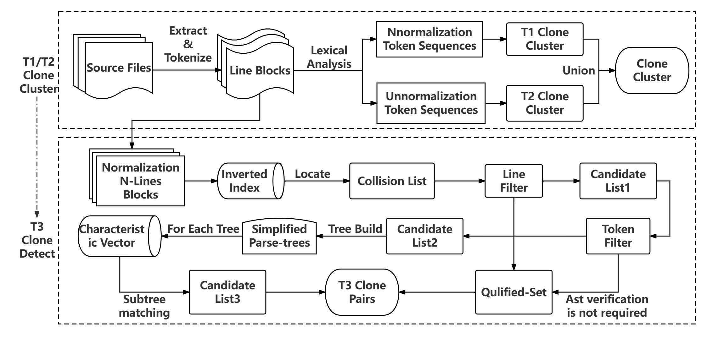

# SCCD Usage
The overall process of SCCD can be shown in the figure below. 

## Requirements
- JDK 8+
- Antlr4(Installation address:`https://www.antlr.org/`)

## Install & Usage
- Clone this repository (`git clone https://xxxxxx`)
- Move into /src/main/java directory (`cd /src/main/java`) 
- Run Project (`javac Main.java && java Main [options]`)
- For Example: `java Main -input xx -N 10 -lv 0`

- Output file format: 
    - cloneUnitInfo.csv
	`[function ID, function path, start line, end line, actual LOC]`
    - T1.csv
	`[function1, function2]`
    - T2.csv
	`[function1, function2]`
    - T3_x.csv
	`[function1, function2]`
- Notice:
    - The `actual LOC` in `cloneUnitInfo.csv` represents the actual number of lines of code that do not contain blank lines and comments.
    - The first column of `T1.csv/T2.csv` represents the clone unit with the smallest label of a clone cluster, and the second column is the element in the clone cluster. For example, `T1.csv` has the following two lines: `[1, 2],[1, 3]`, which means that clone unit 1, 2 and 3 belong to the same clone cluster, and they are T1 clones of each other. Clone unit 1 should continue to participate in the subsequent T3 clone detection, while 2 and 3 do not need to participate. In other words, only the clone unit with the smallest ID in each cluster needs to participate in T3 clone detection.
    - The `x` in `T3_x.csv` represents the T3 clone detection results of group `x`. `T3.csv` does not include clones in `T1.csv` and `T2.csv`.

 - Execution process
  The execution entry of the program is Main.java. 
    - The first step is to extract all qualified files from the given path. (Associated file is myutils/SolidityExtract.java) 
    - The  The second step is to use Antlr4 to parse the extracted files and decide whether to store them according to the requirements. (Associated file is antlr4Sol/SolidityLexer.java, antlr4/SolidityParser.java, clonedetect/PreProcess.java)
    - The third step is to find out all possible clone pairs. The specific methods are as follows. (Associated file is clonedetect/CloneDetect.java) 
	    1. Sort the unnormalized hash value and those clone units with the same hash value are reported as T1 clones.
	    2. Sort the normalized hash value and those clone units with the same hash value are reported as T2 clones. 
	    3. Select a group of clone units to build an inverted index (a map, the key is N-gram, and the value is the ID of the clone units containing the key), which can be used to quickly select the clone candidate set. 
	    4. Calculate the N-Line similarity. If it is less than $\theta_1$, it will be discarded directly. If it is greater than $\mu_1$, it will be reported as T3 clone. The processing scheme of token is similar to that of N-lines. The remaining clone units need to calculate the ast similarity. If it is greater than $\mu_3$, it will be reported as T3 clone. Otherwise, it will be discarded.

## Options
|Name|Description|Default|
|:--:|:--|:--:|
|`-input`|Input source directory. You must specify the target dir.|`None`|
|`-N`|N for N-Lines.|`10`|
|`-partition`|The number of partitions.|`1`|
|`-output`|Output file directory.|`./output/file/`|
|`-thread`|The number of threads used for parallel execution (both the *Preprocess* and *Clone detection* phases)|`50`|
|`-t1`|N-line based filter score $\theta_1$.|`0.1`|
|`-t2`|Token based filter score $\theta_2$.|`0.2`|
|`-v1`|N-line based verification score $\mu_1$.|`0.6`|
|`-v2`|Token based verification score $\mu_2$.|`0.7`|
|`-v3`|Ast based verification score $\mu_3$.|`0.65`|
|`-lv`|Clone  level(contract, subcontract, function level).|`0`|
|`-ml`|Min line number of clone unit.|`20`|

## Module Introduction
<table border="1">
    <tr>
        <th align="center">fir-category</th>  
        <th align="center">sub-category</th> 
        <th align="center">input</th>  
        <th align="center">output</th>  
        <th align="center">function</th>  
    </tr>
    <tr>
        <td rowspan="1">Main.java</td>
        <td>--</td>
        <td>The project path to be detected.</td>
        <td>Two CSV files described above</td>
        <td>Include three steps:1.Load solidity file's path. 2.Processing files into clone units. 3.Clone detection and output the result.</td>
    </tr>
    <tr>
        <td rowspan="2">myutils</td>
        <td>Func.java</td>
        <td>Line, token, ast and position information.</td>
        <td>None</td>
        <td>Clone Unit.</td>
    </tr>
    <tr>
        <td>SolidityExtract.java</td>
        <td>Project path.</td>
        <td>A list of all .sol file under the project.</td>
        <td>Extract all files in the specified format under a directory.</td>
    </tr>
    <tr>
        <td rowspan="3">clonedetect</td>
        <td>Data.java</td>
        <td>Clone threshold, project path, N, T1/T2 hash list, clone pairs.</td>
        <td>None</td>
        <td>Central unit for information storage.</td>
    </tr>
    <tr>
        <td>PreProcess.java</td>
        <td>A .sol file path.</td>
        <td>A map of all eligible clone units in the input file.</td>
        <td>Processing source files into basic units for clone detection.</td>
    </tr><tr>
        <td>CloneDetect.java</td>
        <td>Unit ID for clone detection. Inverted index:(N-Line hash, funcID).</td>
        <td>All clone pairs:&lt;funcID, set&lt;funcID&gt;&gt;</td>
        <td>All methods uesd to detect clone pairs.</td>
    </tr>
    <tr>
        <td rowspan="4">clonedetect</td>
        <td>SolidityLexer.java</td>
        <td>Character stream.</td>
        <td>A token list.</td>
        <td>Responsible for breaking the input text into tokens, which are then fed to the parser.</td>
    </tr>
    <tr>
        <td>SolidityParser.java</td>
        <td>A token list.</td>
        <td>A parse tree.</td>
        <td>Takes the tokens produced by the lexer and builds a parse tree based on the rules in the grammar.</td>
    </tr>
    <tr>
        <td>SolidityBaseListener.java</td>
        <td>The root node of parse tree.</td>
        <td>A way of traversing the tree</td>
        <td>Used to traverse the parse tree generated by the parser, but provide empty method.</td>
    </tr>
    <tr>
        <td>SolidityListener.java</td>
        <td>The root node of parse tree.</td>
        <td>A way of traversing the tree</td>
        <td>Extend the SolidityBaseListene and provides a more specific implementation of the listener interface.</td>
    </tr>
</table>